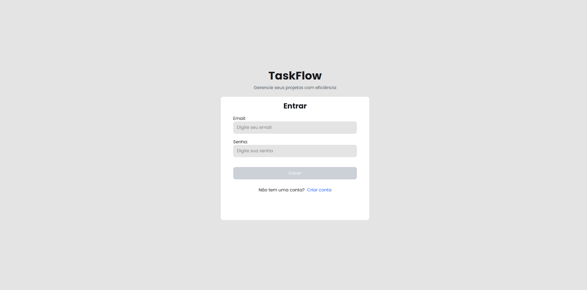
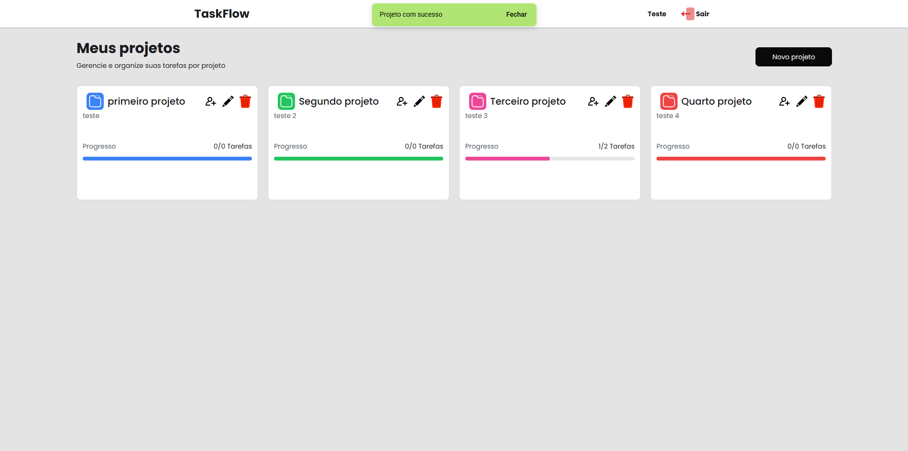
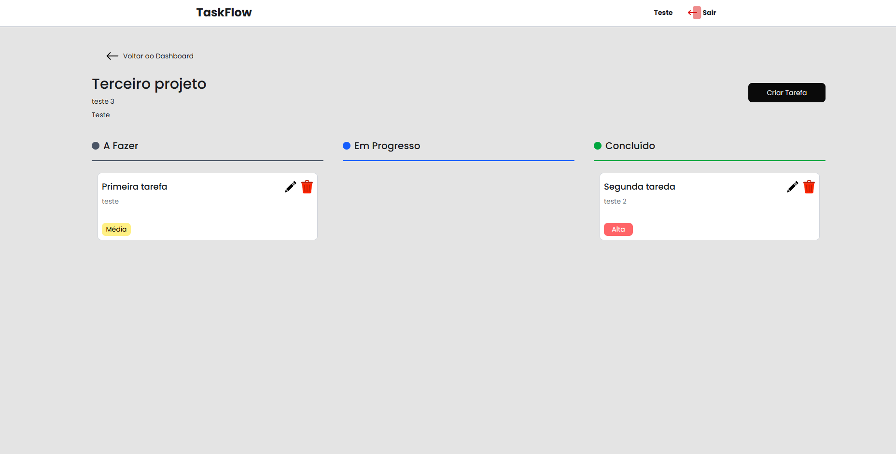

# TaskFlow - Task Management System

Sistema de gerenciamento de tarefas desenvolvido com Angular e ASP.NET Core, com autenticação JWT e controle de projetos.

## Tecnologias

### Frontend
- Angular
- TypeScript
- Tailwind CSS

### Backend
- ASP.NET Core
- C#
- Entity Framework Core
- SQL Server

- ## Segurança

- Senhas armazenadas com hash no backend
- Autenticação via JWT (JSON Web Token)
- Refresh Token para renovação de sessão

## Funcionalidades

- Cadastro e login de usuários
- Autenticação com JWT e Refresh Token
- Criação de projetos
- CRUD de tarefas
- Controle de status (A Fazer, Em Progresso, Concluído)
- Indicadores de progresso

## O que aprendi

- Desenvolvimento full stack com Angular e ASP.NET Core
- Autenticação com JWT e Refresh Token
- Comunicação entre frontend e backend
- Boas práticas de API REST

## prints

### Login

### Dashboard

### Tarefas

